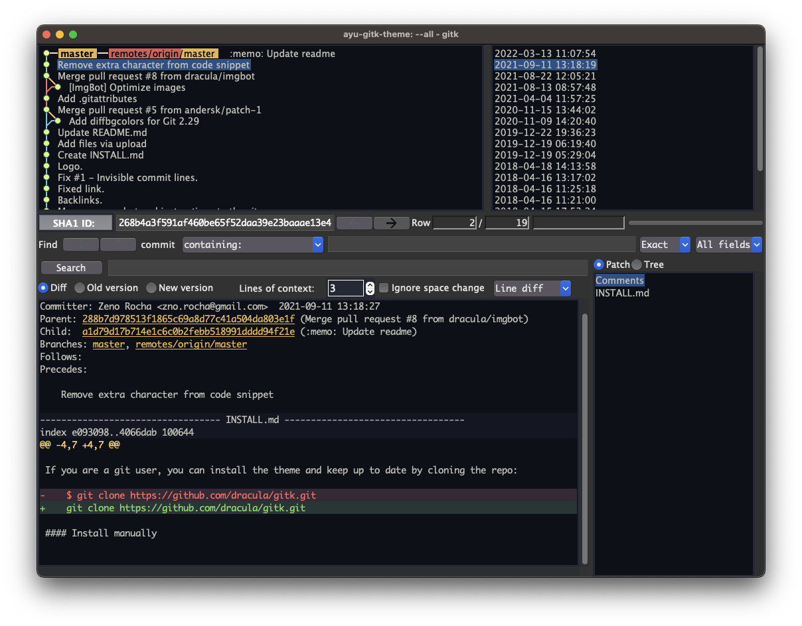

# Ayu for [gitk](https://git-scm.com/docs/gitk)

> Dark theme for [gitk](https://git-scm.com/docs/gitk).

## Install

#### Install using Git

If you are a git user, you can install the theme and keep up to date by cloning the repo:

    git clone https://github.com/manila/ayu-gitk-theme.git

#### Install manually

Download using the [GitHub .zip download](https://github.com/manila/ayu-gitk-theme/archive/master.zip) option and unzip them.

#### Activating theme

1.  `mkdir -p ~/.config/git`
2.  `cp gitk/ayu-dark-gitk ~/.config/git/gitk`

## License

[MIT License](./LICENSE)
